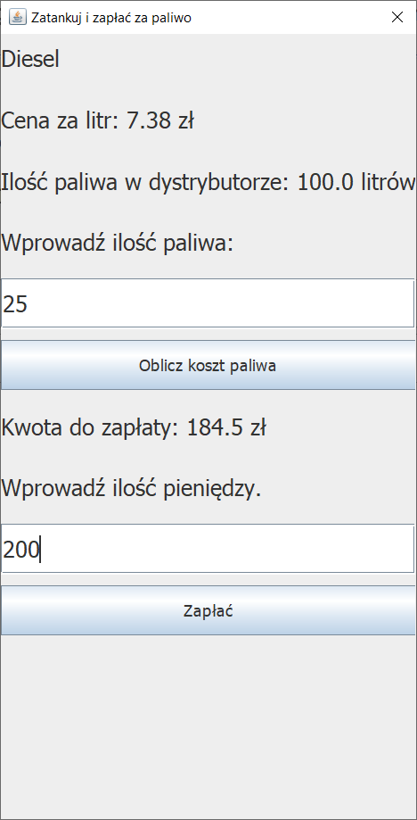

# Project EN

## Description

Application simulate self-service gas station.
In application you can be:

- client can:
  - select dispenser
  - tank fuel
  - pay for fuel
- employee can:
  - select dispenser
  - repair dispenser
  - repair receipt printer
  - repair cash register
  - change price of fuel per litr
  - refuel dispenser
  - reset money in cash register
  - see cash register status
  - see all payments
  - see payments per dispenser

Password to employee view is: employee

## Technologies

Used technologies:
- Java
- Swing

## Requirements

- Java

# Project PL

Aplikaja symuluje działanie samoobsługowej stacji paliw.

Aplikacja działa w dwóch trybach:

- klient może:
  - wybrać dystrybutor
  - zatankować paliwo
  - zapłacić za paliwo
- pracownik może:
  - wybrać dystrybutor
  - naprawić dystrybutor
  - naprawić drukarkę paragonów
  - naprawić kasę fiskalną
  - zmienić cenę za litr paliwa
  - napełnić dystrybutor do pełna
  - napełnić kasę fiskalną do pełna
  - zobaczyć ile jest jakich banknotów w kasie fiskalnej
  - zobaczyć wszystkie płatności
  - zobaczyć płatności dla każdego dystrybutora

Hasło do widoku pracownika to: employee

## Technologie

Użyte technologie:
- Java
- Swing

## Wymagania

- Java
  
# Screenshots of application/Zrzuty ekranu aplikacji

## Choose role/Wybierz rolę

## Enter name and surname/Podaj imię i nazwisko

## Select dispenser/Wybierz dystrybutor

## Enter amount of fuel/Podaj ilość paliwa

## Pay for fuel/Zapłać za paliwo

## Receipt/Paragon

## Enter password/Podaj hasło

## Cash register is broken/Kasa fiskalna jest popsuta

## Repair cash register/Napraw kasę fiskalną

## Change price of fuel/Zmień cenę paliwa

## After price changed and after filling the distrbutor/ Po zmianie ceny i napełnieniu dystrybutora

## Payments per distributor/Płatności w dystrybutorze

## All payments/Wszystkie płatności

## Status of cash register/Stan kasy fiskalnej

